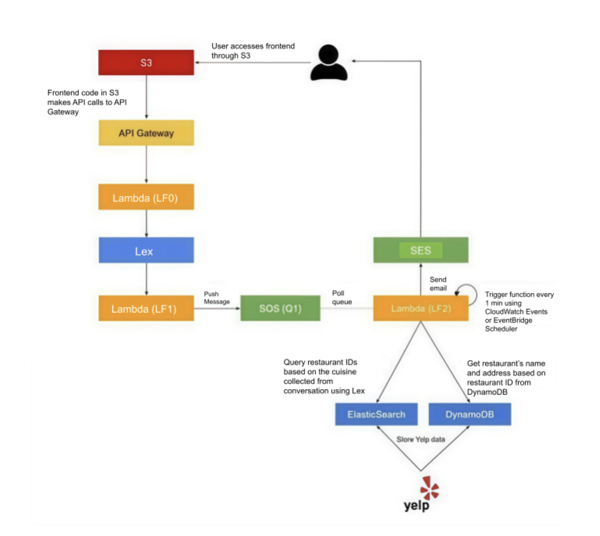

# 🌩️ Cloud Computing (Fall 2025) – Assignment 1  
## 🍽️ Dining Concierge Chatbot — AWS Serverless Application  - [YouTube Demo Link](https://youtu.be/DkdtiURvQ0o) 

A **Dining Concierge Chatbot** built using **AWS serverless services**, enabling users to receive personalized restaurant recommendations through a conversational interface.  

---

### 👤 Student  
**Tilak Bhansali (tb3525)**  
MS in Computer Science @ NYU Tandon    
🔗 [GitHub: tilak30](https://github.com/tilak30)

---

## 🧭 Overview  

This project implements a **serverless, microservice-based web application** built entirely on **AWS**.  
The Dining Concierge Chatbot collects user dining preferences — **location**, **cuisine**, **dining time**, **party size**, and **email** — and provides restaurant recommendations via email.

It demonstrates how cloud-native services can be orchestrated to create an intelligent, scalable, and fully automated system. The project integrates multiple AWS components, including:  
- **Amazon S3** – to host the static frontend  
- **Amazon Lex** – for natural language understanding and chatbot dialogue management  
- **AWS Lambda** – for backend logic and event handling  
- **Amazon SQS** – to decouple chatbot and recommendation processing  
- **Amazon DynamoDB** – for restaurant and user session data storage  
- **Amazon SES** – to send restaurant recommendations via email  
- **Amazon OpenSearch** – for fast and efficient cuisine-based search  
- **Amazon CloudWatch** – for monitoring and event-driven automation  
- **API Gateway** – to expose REST endpoints connecting frontend and backend  

Together, these services form an **event-driven**, **serverless workflow** that demonstrates real-world cloud computing principles.

---

## ☁️ Architecture  

The chatbot is built entirely on AWS with the following services:

| Service | Role |
|----------|------|
| **Amazon S3** | Hosts the static frontend web application |
| **Amazon Lex (V1/V2)** | Conversational AI that handles user dialogue and slot collection |
| **AWS Lambda (LF0, LF1, LF2)** | Backend logic for API, Lex hook, and recommendation processing |
| **API Gateway** | REST interface connecting the frontend to the backend |
| **Amazon SQS** | Queue to decouple chatbot and restaurant recommendation services |
| **Amazon DynamoDB** | Stores restaurant data and user search history |
| **Amazon OpenSearch** | Enables fast restaurant search by cuisine or location |
| **Amazon SES** | Sends restaurant recommendations via email |
| **Amazon CloudWatch / EventBridge** | Monitors logs and triggers backend workflows |

---

## ✨ Features  

✅ Interactive chatbot interface using **Amazon Lex**  
✅ Collects dining preferences through natural conversation  
✅ Pushes user data to **SQS** for asynchronous processing  
✅ Fetches **1000+ restaurants** from the **Yelp API** and stores them in **DynamoDB**  
✅ Indexes restaurants in **OpenSearch** for quick retrieval  
✅ Sends personalized restaurant suggestions via **SES**  
✅ Fully **serverless**, **event-driven**, and **auto-scalable** architecture  

---

## 🧩 Components  

### 🖥️ 1. Frontend (Web Client)  
- Static web application hosted on **S3**  
- Communicates with backend via **API Gateway**  
- Sends user messages to the **/chatbot** endpoint connected to LF0  

---

### ⚙️ 2. Backend Services  

#### **LF0 — Chatbot API**
- Exposed via **API Gateway**
- Receives messages from the frontend and interacts with **Lex**

#### **LF1 — Lex Code Hook**
- Connected as both **DialogCodeHook** and **FulfillmentCodeHook**
- Implements intents:
  - `GreetingIntent`
  - `ThankYouIntent`
  - `DiningSuggestionsIntent`
- Validates slot data (email, party size, etc.)
- Sends collected user preferences to **SQS**

#### **LF2 — Recommendation Service**
- Triggered by **SQS messages**
- Queries **DynamoDB** and **OpenSearch** for restaurant matches
- Sends formatted email suggestions via **SES**

---

## 🔁 Data Pipeline  

### 🍴 1. Yelp API Data Collection  
- Retrieves restaurant data from **Yelp Fusion API** across 5 cuisines:  
  **Chinese**, **Indian**, **Italian**, **Mexican**, and **Thai**  
- ~200 restaurants per cuisine (~1000 total)  
- Each record includes:  
  - Business ID  
  - Name  
  - Address  
  - Coordinates  
  - Reviews  
  - Rating  
  - Zip Code  
  - Cuisine  
  - `insertedAtTimestamp`

### 💾 2. Storage  
- Restaurant data stored in **DynamoDB** (`yelp-restaurants` table)  
- Indexed in **OpenSearch** for quick querying

### 📬 3. Processing & Communication  
- Lex → LF1 → SQS → LF2 → SES  
- User requests flow through **queue-based** and **event-driven** architecture for scalability and reliability  

---

## 💬 Example Conversation Flow  

| 🗣️ User Input | 🤖 Bot Response |
|---------------|----------------|
| Hi | Hi there! How can I help you today? |
| Find me an Italian restaurant | Sure, what location are you looking for? |
| New York | Great! For how many people? |
| 2 | Got it. What time would you like to dine? |
| 7 PM | Please share your email so I can send recommendations. |
| abc@example.com | You're all set! I'll email you restaurant suggestions shortly. |

---

## 🧠 Key Learnings  

- 🧩 Designing **serverless**, **event-driven** cloud applications  
- 💬 Integrating **Lex**, **Lambda**, **SQS**, **DynamoDB**, **SES**, and **OpenSearch**  
- 🍴 Applying **Yelp API** for large-scale restaurant data ingestion  
- ⚙️ Automating backend pipelines using **CloudWatch** and **EventBridge**  
- 🔄 Understanding inter-service communication and scalability in **AWS**  

---

## 🎥 Demo  

📺 **YouTube Demo:** [YouTube Demo Link](https://youtu.be/DkdtiURvQ0o) 

---

## 🏗️ Architecture Diagram

The diagram below illustrates the AWS serverless architecture of the Dining Concierge Chatbot.



---

⭐ **Project by:** *Tilak Bhansali (tb3525)*  
📍 *NYU Tandon School of Engineering – Cloud Computing (Fall 2025)*

---

### Data Flow (Mermaid)

```mermaid
graph LR
  User -->|1. Send message| API[API Gateway]
  API -->|2. Invoke| LF0[LF0 Lambda - Chatbot API]
  LF0 -->|3. Forward| Lex[Amazon Lex]
  Lex -->|4. Invoke| LF1[LF1 Lambda - Lex Hook]
  LF1 -->|5. Push| SQS[SQS Queue]
  SQS -->|6. Trigger| LF2[LF2 Lambda - Recommendation Service]
  LF2 -->|7. Query| DB[DynamoDB]
  LF2 -->|7b. Search| OS[OpenSearch]
  LF2 -->|8. Send Email| SES[Amazon SES]
  SES -->|9. Deliver| Inbox[User Inbox]


